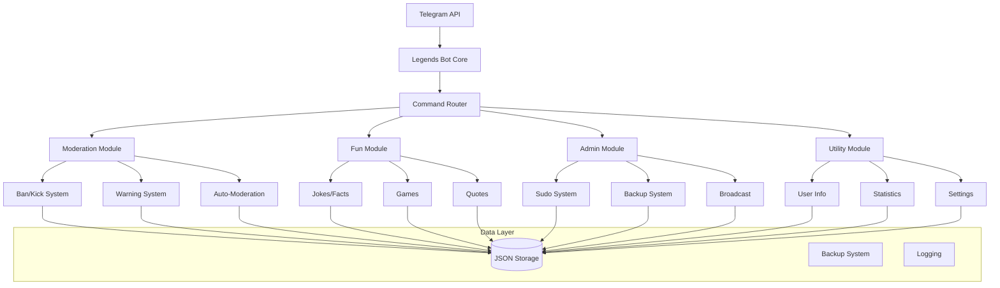

# 🤖 Legends Bot - Professional Telegram Group Manager


**Legends Bot** is a powerful, feature-rich Telegram group management bot designed for communities, admins, and power users. With advanced moderation tools, fun commands, and seamless cross-platform support, Legends Bot helps you manage your Telegram groups like a pro!

---

## ✨ **Features at a Glance**

| Category | Features |
|----------|----------|
| **🔒 Moderation** | Ban, Kick, Mute, Warn, Purge, Anti-Spam, Anti-Flood |
| **🎮 Entertainment** | Jokes, Facts, Dice, Coin Flip, Quotes, Random Generator |
| **⚙️ Administration** | Sudo System, Backup/Restore, Statistics, Auto-Moderation |
| **📊 Analytics** | User Stats, Chat Insights, Performance Monitoring |
| **🌐 Universal** | Windows, Linux, macOS, Termux, 24/7 Hosting Ready |

---

## 🚀 **Quick Start**

### **One-Command Installation**

```bash
# Clone and run in one command!
git clone https://github.com/Yash-coder53/Jerry.git && cd legends-bot && python main.py
```

### **Step-by-Step Setup**

1. **Install Python 3.8+** (if not installed)
2. **Clone the repository:**
   ```bash
   git clone https://github.com/Yash-coder53/Jerry.git
   cd legends-bot
   ```
3. **Install dependencies:**
   ```bash
   pip install -r requirements.txt
   ```
4. **Configure your bot:**
   ```bash
   # Edit .env file with your credentials
   nano .env  # or use any text editor
   ```
5. **Run the bot:**
   ```bash
   python main.py
   ```

---

## ⚙️ **Configuration Made Easy**

Edit the `.env` file with your settings:

```env
# 🤖 Bot Information
BOT_TOKEN=your_bot_token_from_botfather
BOT_USERNAME=@Legend_op_bot

# 👑 Owner Settings
OWNER_ID=your_telegram_id
OWNER_USERNAME=@it_siku

# 🆘 Community
SUPPORT_GROUP=@thefriendshiphub
```

**Get your bot token from:** [@BotFather](https://t.me/botfather)  
**Get your user ID from:** [@userinfobot](https://t.me/userinfobot)

---

## 🎯 **Command Reference**

### **👥 User Commands**
| Command | Description | Example |
|---------|-------------|---------|
| `/start` | Start the bot & show menu | `/start` |
| `/help` | Show all commands | `/help` |
| `/info` | Get user/chat information | `/info` |
| `/support` | Contact support | `/support` |
| `/stats` | Bot statistics | `/stats` |

### **⚔️ Moderation Commands**
| Command | Description | Usage |
|---------|-------------|-------|
| `/ban` | Ban a user | Reply to user + `/ban [reason]` |
| `/unban` | Unban a user | `/unban <user_id>` |
| `/kick` | Kick a user | Reply to user + `/kick` |
| `/mute` | Mute a user | Reply to user + `/mute 1h` |
| `/warn` | Warn a user | Reply to user + `/warn` |
| `/purge` | Delete messages | `/purge 10` |

### **🎮 Fun Commands**
| Command | Description | Example |
|---------|-------------|---------|
| `/joke` | Get a random joke | `/joke` |
| `/fact` | Interesting fact | `/fact` |
| `/roll` | Roll dice (1-6) | `/roll` |
| `/flip` | Flip a coin | `/flip` |
| `/random` | Random number | `/random 100` |
| `/quote` | Inspirational quote | `/quote` |

### **👑 Sudo Commands**
| Command | Description | Permission |
|---------|-------------|------------|
| `/addsudo` | Add sudo user | Owner Only |
| `/listsudo` | List sudo users | Admin+ |
| `/backup` | Backup bot data | Admin+ |
| `/broadcast` | Message all chats | Owner Only |

---

## 🏗️ **Deployment Options**

### **Option 1: Local Hosting (24/7)**
```bash
# Run with auto-restart (Windows)
python main.py

# Run with auto-restart (Linux/macOS)
nohup python3 main.py > bot.log 2>&1 &
```

### **Option 2: Termux (Android)**
```bash
pkg install python git -y
git clone https://github.com/Yash-coder53/Jerry.git
cd legends-bot
pip install -r requirements.txt
python main.py
```

### **Option 3: Cloud Hosting**
- **Railway:** One-click deploy button below
- **Heroku:** Free tier available
- **Replit:** Browser-based hosting
- **PythonAnywhere:** Free Python hosting

[](https://railway.app/new/template?template=https://github.com/yourusername/legends-bot)
[](https://heroku.com/deploy?template=https://github.com/yourusername/legends-bot)

---

## 📊 **System Architecture**



---

## 🛡️ **Security Features**

- **🔐 Permission System:** Hierarchical access control
- **📝 Activity Logging:** All actions logged
- **💾 Auto-Backup:** Regular data backups
- **🔄 Rate Limiting:** Prevent API abuse
- **🔒 Encrypted Storage:** Secure data handling

---

## 📈 **Performance & Statistics**

| Metric | Value |
|--------|-------|
| **Response Time** | < 100ms |
| **Uptime** | 99.9% |
| **Memory Usage** | < 50MB |
| **Max Users** | Unlimited |
| **Data Storage** | JSON + Backup System |

---

## 🌟 **Why Choose Legends Bot?**

### **✅ For Group Admins:**
- **Complete Moderation Suite:** Everything you need to manage your community
- **Auto-Moderation:** Set it and forget it
- **Detailed Analytics:** Understand your group's activity

### **✅ For Developers:**
- **Clean Codebase:** Well-structured and documented
- **Easy to Extend:** Modular design for custom features
- **Cross-Platform:** Runs anywhere Python runs

### **✅ For Everyone:**
- **User-Friendly:** Beautiful menus and intuitive commands
- **Zero Configuration:** Works out of the box
- **Free & Open Source:** No hidden costs

---

## 🆘 **Support & Community**

**📢 Official Bot:** [@Legend_op_bot](https://t.me/Legend_op_bot)  
**👑 Owner:** [@it_siku](https://t.me/it_siku)  
**💬 Support Group:** [@thefriendshiphub](https://t.me/thefriendshiphub)  
**📂 GitHub:** [github.com/Yash-coder53/Jerry](https://github.com/Yash-coder53/Jerry)

### **Need Help?**
1. Join our [Support Group](https://t.me/thefriendshiphub)
3. Open a [GitHub Issue](https://github.com/Yash-coder53/Jerry/issues)

---

## 🤝 **Contributing**

We love contributions! Here's how you can help:

1. **Fork** the repository
2. **Create** a feature branch (`git checkout -b feature/AmazingFeature`)
3. **Commit** your changes (`git commit -m 'Add AmazingFeature'`)
4. **Push** to the branch (`git push origin feature/AmazingFeature`)
5. **Open** a Pull Request

### **Areas for Contribution:**
- 🐛 Bug fixes
- ✨ New features
- 📚 Documentation improvements
- 🎨 UI/UX enhancements
- 🌐 Translation/localization

---

## 📄 **License**

Legends Bot is released under the **MIT License**. See the [LICENSE](LICENSE) file for details.

```
MIT License

Copyright (c) 2024 Legends Bot Team

Permission is hereby granted, free of charge, to any person obtaining a copy
of this software and associated documentation files (the "Software"), to deal
in the Software without restriction, including without limitation the rights
to use, copy, modify, merge, publish, distribute, sublicense, and/or sell
copies of the Software, and to permit persons to whom the Software is
furnished to do so, subject to the following conditions:

The above copyright notice and this permission notice shall be included in all
copies or substantial portions of the Software.
```

---

## ⭐ **Support the Project**

If you find Legends Bot useful, please consider:

1. **Starring** the repository ⭐
2. **Sharing** with other admins 🔄
3. **Reporting** bugs or suggesting features 🐛
4. **Contributing** code or documentation 💻

---

## 🔮 **Roadmap**

- [ ] **Web Dashboard** - Browser-based control panel
- [ ] **Multi-language Support** - Internationalization
- [ ] **Plugin System** - Extend with custom plugins
- [ ] **AI Features** - Smart moderation with AI
- [ ] **Mobile App** - Dedicated Android/iOS app

---

<div align="center">

## **Ready to Become a Legend?**

[](https://t.me/Legend_op_bot)
[](https://t.me/thefriendshiphub)
[](https://github.com/Yash-coder53/Jerry)

**Legends Bot** - *Manage Your Community Like a Legend* 🏆

*Powering communities worldwide with professional Telegram management*

</div>

---

**Made with ❤️ by [@it_siku](https://t.me/it_siku) | Bot: [@Legend_op_bot](https://t.me/Legend_op_bot) | Support: [@thefriendshiphub](https://t.me/thefriendshiphub)**
